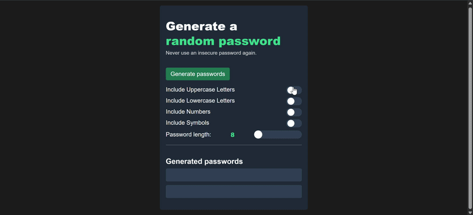

# Password Generator

A clean, modern password generator built with vanilla HTML, CSS, and JavaScript. This project helps users quickly generate random passwords with customizable character types and length, then copy the result with a single click.
This project was built as part of my journey learning and strengthening vanilla HTML, CSS, and JavaScript.

## Demo



## Overview

This app provides a simple yet polished interface for creating random passwords. It lets users choose whether to include uppercase letters, lowercase letters, numbers, and symbols, then generates two password options at the selected length.

The generator runs entirely in the browser, so there is no backend or database required. Passwords are created client-side and copied to the clipboard using the browser's Clipboard API.

## Features

- Generate two random passwords at once
- Toggle inclusion of:
  - uppercase letters
  - lowercase letters
  - numbers
  - symbols
- Adjust password length from 8 to 16 characters
- Prevent invalid generation when no character type is selected
- Copy password output with visual confirmation feedback
- Responsive dark-themed UI for a modern look
- Accessible form labels and alert messaging

## Tech Stack

- HTML5
- CSS3
- JavaScript (ES6)

## Project Structure

```text
password-generator/
├── index.html        # Application structure and UI
├── index.css         # Styling and layout
├── index.js          # Password generation and interaction logic
├── README.md         # Project documentation
└── assets            # Project static assets
```

## How It Works

1. The user selects the character sets they want included.
2. A length is chosen using the slider control.
3. Clicking the generate button creates a random password using the selected character pool.
4. The app validates that at least one option is selected before generating.
5. The password can be copied directly from the output panel.

## Getting Started

### Prerequisites

- A modern web browser such as Chrome, Edge, Firefox, or Safari
- No install step is required for the base project

### Run the App

1. Clone the project into your local machine.
2. Open the project folder and launch the application in a browser.
3. Open `index.html` directly in your browser or serve it locally with a small static server:

```bash
python -m http.server 8000
```

Then visit:

```text
http://localhost:8000
```

## Usage

1. Open the web app.
2. Choose the character types you want included.
3. Adjust the password length with the slider.
4. Click the Generate passwords button.
5. Select a generated password or use the copy button to copy it to the clipboard.

## Security Notes

This project is intended for simple front-end password generation and educational use. For production-grade password management scenarios, consider using a secure password manager and strong enterprise security practices.
I will improve this later.

## Customization

You can customize the app by:

- changing the default password length
- adjusting the color palette in `index.css`
- modifying the available character sets in `index.js`
- adding additional UI elements or validation logic